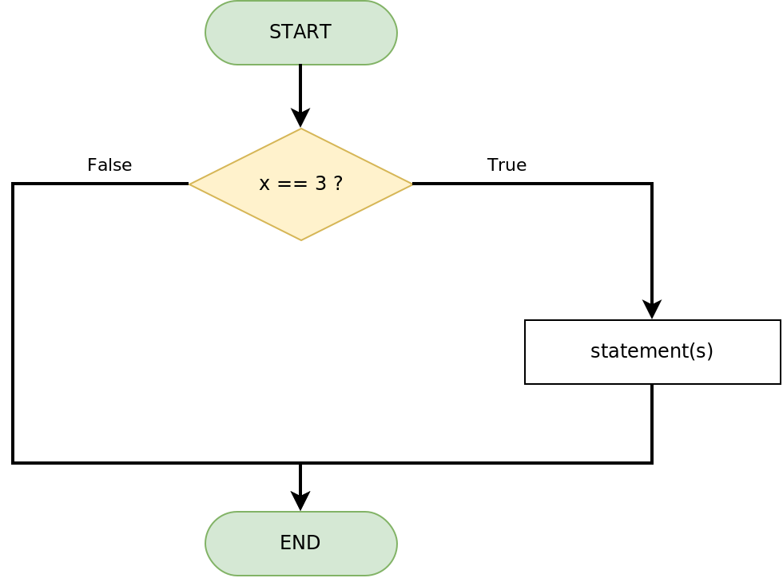
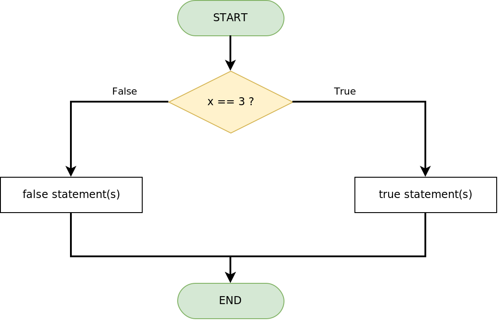
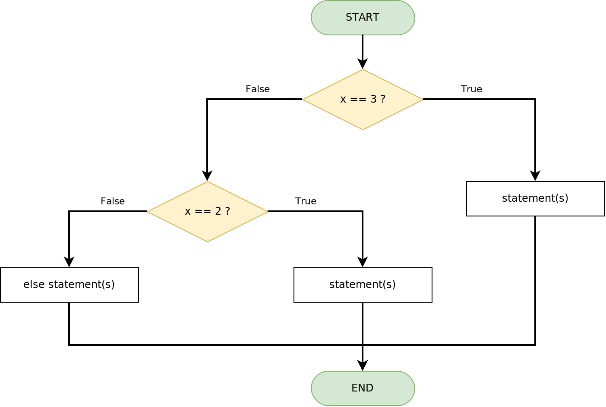
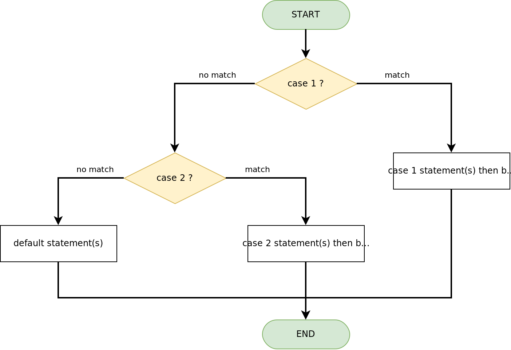

# Binary Selection Control Structure Flowcharts

Standard: **True/match exits RIGHT, False/no match exits LEFT.** Decisions and END terminators are always entered from the top.

## IF Statement

    int x = 3;
    if (x == 3) {
        // statement(s)
    }

_Note: `if (x = 3)` will always return true because the code assigns 3 to `x` and the assignment evaluates as true. This is a common logic error: use `==` to compare._

## IF ELSE Statement

    int x = 3;
    if (x == 3) {
        // true statement(s)
    } else {
        // false statement(s)
    }

## IF ELSE IF ELSE Statement

    int x = 3;
    if (x == 3) {
        // statement(s)
    } else if (x == 2) {
        // statement(s)
    } else {
        // else statement(s)
    }

_Note: if more than one condition is true, only the FIRST true branch executes. The flow exits the whole structure as soon as one branch runs._

## SWITCH CASE Statement

    int x = random(0, 3);
    switch (x) {
        case 1:
            // do something when x equals 1
            break;
        case 2:
            // do something when x equals 2
            break;
        default:
            // if nothing else matches, run the default
            break;
    }

_Note: without `break;` execution falls through into the next case. Occasionally useful, usually a bug._
