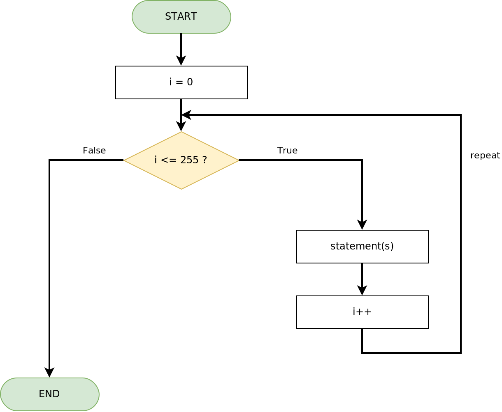
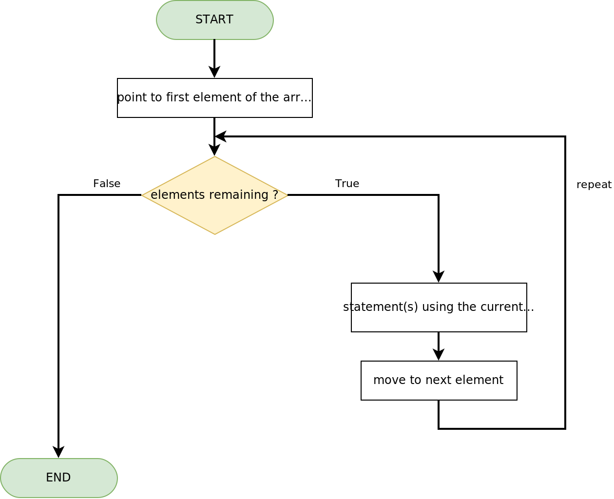
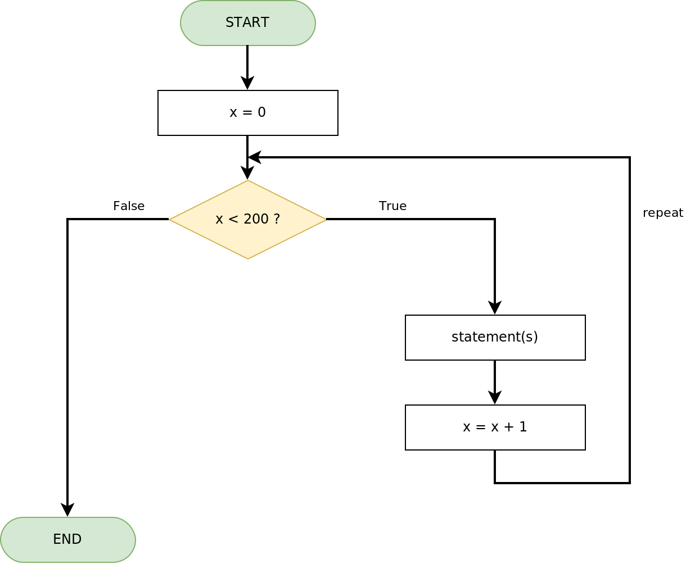
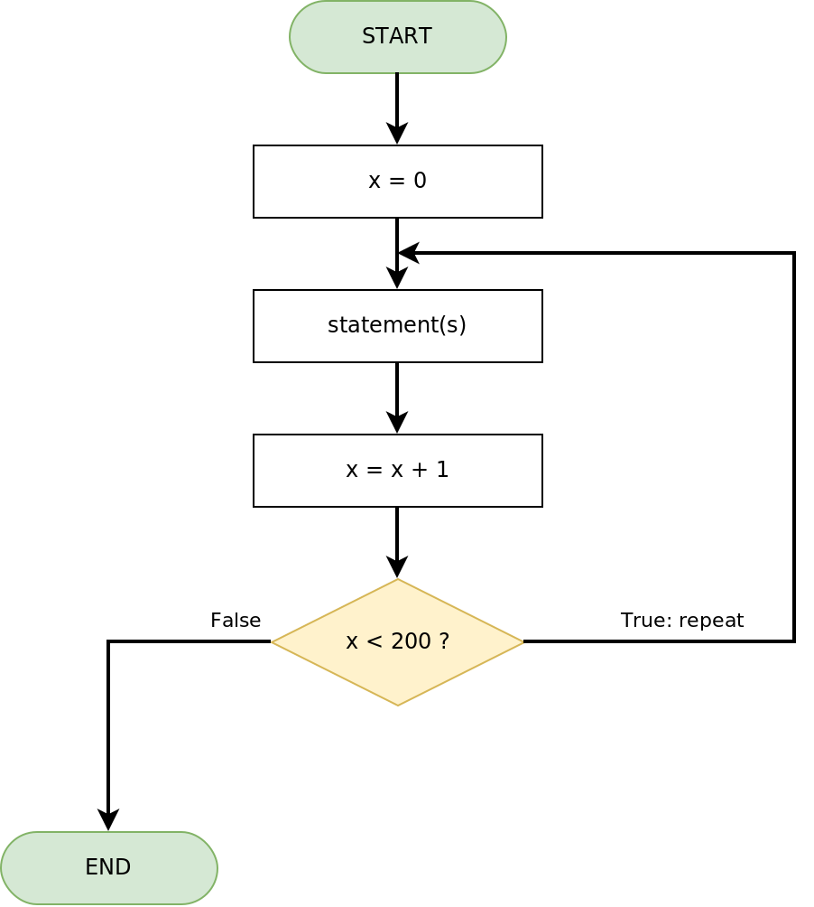

# Loop Logic Control Structure Flowcharts

Standard: **True exits RIGHT, False exits LEFT.** Decisions and END terminators are always entered from the top. Loop-back lines re-join the main flow line above the decision.

## FOR Statement (Count Loop)

    for (int i = 0; i <= 255; i++) {
        analogWrite(PWM_PIN, i);
        delay(10);
    }

## FOR EACH Statement (Count Loop over an Array)

    int arr[] = {1, 2, 3, 4, 5};
    for (int i : arr) {
        Serial.print(i);
        Serial.print(", ");
    }

## WHILE Statement (Pre-test Loop)

    int x = 0;
    while (x < 200) {
        // statement(s)
        x = x + 1;
    }

_Note: the condition is tested BEFORE each pass, so the body may run zero times. If nothing inside the loop pushes the condition toward false, it repeats endlessly._

## DO WHILE Statement (Post-test Loop)

    int x = 0;
    do {
        // statement(s)
        x = x + 1;
    } while (x < 200);

_Note: the body runs FIRST and the condition is tested afterwards, so the body always runs at least once._
