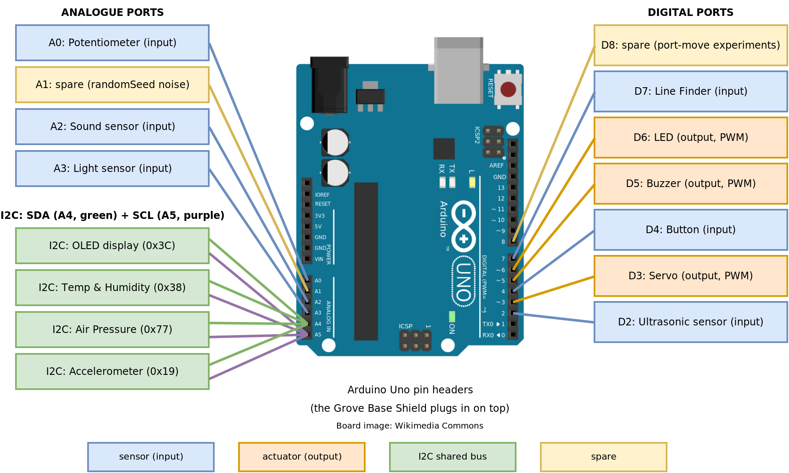

# TempeHS Arduino Bootcamp - TEACHER SOLUTIONS

This is the folder structure and starter files for students completing the TempeHS Arduino Bootcamp.

The bootcamp uses the **official [Arduino Sensor Kit](https://sensorkit.arduino.cc/)**: a Grove base shield and prewired modules that connect with Grove cables (no breadboard wiring needed for the kit modules). Your kit also includes a **Grove Line Finder** and a **Grove 3-pin Ultrasonic sensor**. The motor activities use real wiring with external power.

## Getting started

1. Click **Use this template** then **Create a new repository**
2. Name it using the class convention: `2027CT_Arduino_Bootcamp_FirstName.Initial` (e.g. `2027CT_Arduino_Bootcamp_Ben.J`)
3. Open your repository in a **GitHub Codespace** (the **Arduino to Codespaces Bridge** extension installs automatically)
4. Plug in your Arduino Uno, click the bridge icon in the left navigation bar, run the server, then open the bridge
5. Upload a sketch through the bridge and you are ready to code

Full setup instructions are on the learning platform: **Arduino Bootcamp, Page 1: What is Mechatronics?**

## The working rhythm

**Write** the code in your Codespace, **Upload** it to the Arduino, **Test** it with the sensor kit, then **Commit and Push** every working solution with a clear message and a photo of your build.

## Folder guide

| Folder                      | Lesson                                        | Hardware                                      |
| --------------------------- | --------------------------------------------- | --------------------------------------------- |
| `01.serialMonitor`          | Serial Monitor & Program Structure            | none                                          |
| `02.storingData`            | Variables & Data Types                        | none                                          |
| `03.buttonsAndDecisions`    | Digital I/O + selection (if/else/switch)      | Button D4, LED D6, Line Finder D7             |
| `04.analogueInOut`          | Analogue input + math + PWM output            | Pot A0, Sound A2, Light A3, LED D6, Buzzer D5 |
| `05.loopsAndTime`           | Loops + delay vs millis + random              | Button D4, Buzzer D5, LED D6                  |
| `06.servoMotor`             | Positional servo with the Servo library       | Servo D3, Pot A0                              |
| `07.ultrasonicAndFunctions` | Ultrasonic library + structuring functions    | Ultrasonic D2, Buzzer D5, LED D6              |
| `08.motorFundamentals`      | Direct-wire a DC motor + motor control theory | DC motor, battery pack (real wiring)          |
| `09.I2C`                    | I2C bus, OLED display and sensors             | OLED + I2C sensors                            |
| `10.OOP`                    | Object-Oriented Programming                   | LED D6 + built-in LED                         |
| `00.myProjects`             | Capstone builds                               | your choice                                   |

Each sketch's header comment lists the learning intention, success criteria and Grove ports for that activity. Folders also contain **optional breadboard schematics** (`Bootcamp-*.png`) showing how the same circuits are wired by hand without Grove modules, for anyone who wants to look under the hood.

## Standard Grove ports

| Module                                             | Port    |
| -------------------------------------------------- | ------- |
| **DO NOT USE** (TX/RX serial to your computer)     | D0 / D1 |
| Ultrasonic (3-pin)                                 | D2      |
| Servo                                              | D3      |
| Button                                             | D4      |
| Buzzer                                             | D5      |
| LED                                                | D6      |
| Line Finder                                        | D7      |
| Spare (port-move experiments)                      | D8      |
| Potentiometer                                      | A0      |
| Spare (leave unconnected: `randomSeed` noise)      | A1      |
| Sound sensor                                       | A2      |
| Light sensor                                       | A3      |
| OLED, Temp & Humidity, Air Pressure, Accelerometer | I2C     |

## Links

1. [Arduino Sensor Kit documentation](https://sensorkit.arduino.cc/)
2. [Design Toolkit](https://tempehs.github.io/designToolKit/)
3. [TempeHS Arduino Boilerplate](https://github.com/TempeHS/TempeHS_Ardunio_Boilerplate) including the school sensor, module, shield and electronic component catalogue
